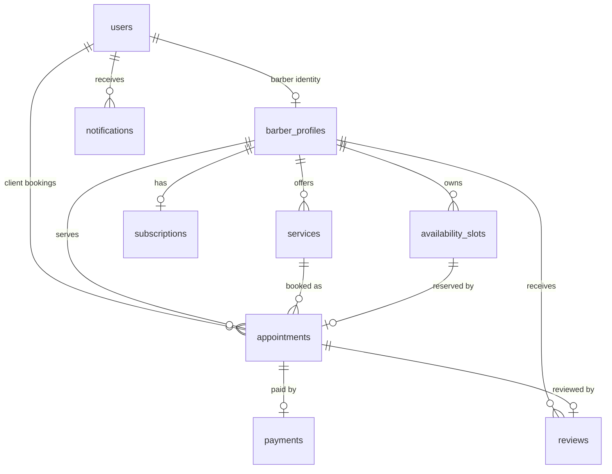

# Database

The schema is normalized around identity, barber operations, booking inventory, appointment lifecycle, payments, subscriptions, reviews, and notifications.

## Tables

| Table                | Purpose                                                                                 |
| -------------------- | --------------------------------------------------------------------------------------- |
| `users`              | Canonical identities for barbers, clients, and admins.                                  |
| `barber_profiles`    | Business profile, marketplace ranking fields, location, media, and subscription status. |
| `services`           | Barber service catalog with price, duration, category, and active state.                |
| `availability_slots` | Bookable time inventory for each barber.                                                |
| `appointments`       | Client bookings and appointment lifecycle state.                                        |
| `payments`           | Stripe-oriented payment records using cents for money.                                  |
| `subscriptions`      | cutG subscription status and feature flags.                                             |
| `reviews`            | One verified review per completed appointment.                                          |
| `notifications`      | Durable queue for in-app, email, SMS, and push notifications.                           |

## ER Diagram

## Design Decisions

- UUID primary keys avoid sequence leakage and work well across distributed systems.
- JSONB metadata fields allow future enrichment without frequent schema churn.
- `updated_at` is maintained by database triggers so every write path stays consistent.
- Soft delete support starts at `users.deleted_at` because identity records need auditability.
- Composite indexes support the first expected high-volume reads: barber schedules, client history, barber history, unread notifications, and recent reviews.
- The location index uses PostgreSQL `cube` and `earthdistance` extensions with `ll_to_earth` so Phase 2 geo-search can start without redesign.

## Migration Notes

Phase 6 is migration `006_mobile_barber.ts`. It creates `mobile_barber_config` for one travel-area configuration per barber and `client_addresses` for geocoded client locations with one default per client.

It extends appointments with copied service location, travel fee, distance, duration, and mobile lifecycle timestamps. Availability slots gain `is_travel_buffer` and `travel_buffer_for` so internal travel inventory can be reserved and released without public exposure. `ON_THE_WAY` and `ARRIVED` remain PostgreSQL enum values during rollback because removing enum values is unsafe when rows may reference them.

`availability_slots` and `appointments` need a two-step relationship. The migration creates `availability_slots`, then `appointments`, then adds `availability_slots.appointment_id` after both tables exist.

Never edit a migration after it has been run in a shared environment. Add a new migration instead.
